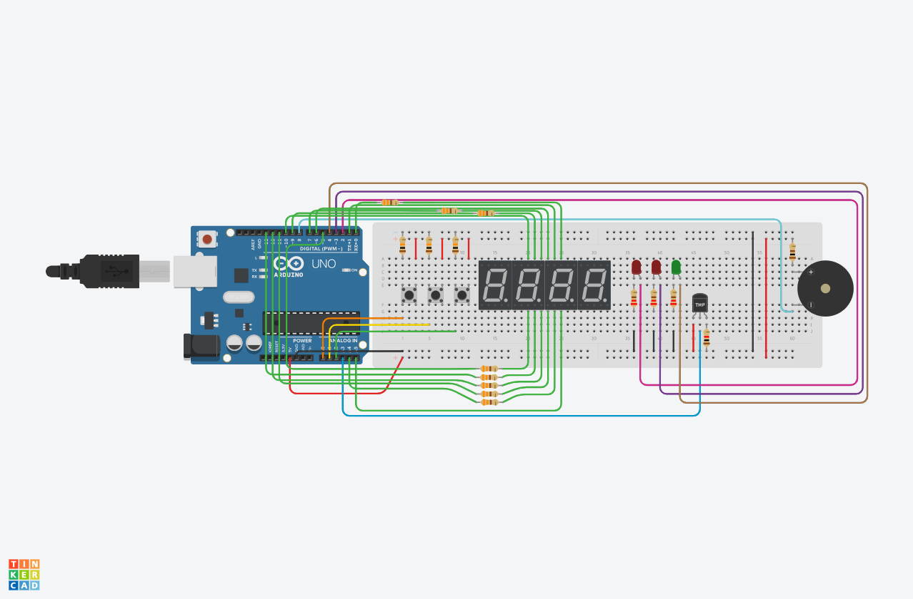

# Arduino Timer Embedded Systems Project
An Arduino timer with a buzzer alarm, control buttons, an analog thermometer and LCD/7Seg Displays

> There are a few discrepancies between the schematics and the actual design as not everything was available in TinkerCad. An Arduino Uno is used instead of the 
> Arduino Mega 2560 that is needed, the 4 digit 7-segment display is replaced by 4 single digit 7-segment displays and also the thermistor is replaced by a TMP sensor

### Information
Lorem Ipsum
### List of Materials (BOM)
- [1x] Arduino (Arduino Mega 2560 is preffered however an Uno works in a pinch)
- [1x] Piezo Buzzer
- [3x] Pushbutton
- [1x] 100 Ω Resistor
- [3x] 220 Ω Resistor
- [1X] 1 kΩ Resistor
- [3X] 10 kΩ Resistor
- [8X] 330 Ω Resistor
- [1x] 4 Digit 7-Segment Display
- [2x] Red LED
- [1x] Green LED
- [1x] MCP23008-based, 32 LCD 16 x 2 (I2C)
- [1x] Thermistor (10k)
