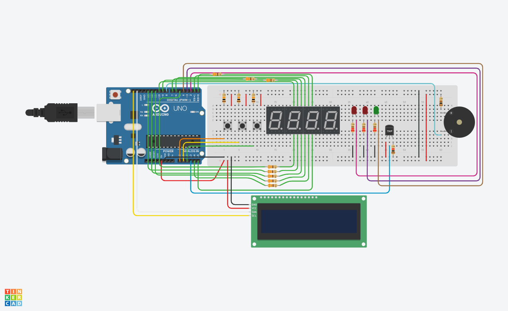

# Arduino Timer Embedded Systems Project
An Arduino timer with a buzzer alarm, control buttons, an analog thermometer and LCD/7Seg Displays

> There are a few discrepancies between the schematics and the actual design as not everything was available in TinkerCad. An Arduino Uno is used instead of the 
> Arduino Mega 2560 that is needed, the 4 digit 7-segment display is replaced by 4 single digit 7-segment displays and also the thermistor is replaced by a TMP sensor

###Information
Lorem Ipsum
###List of Materials (BOM)
- Arduino
- Components
